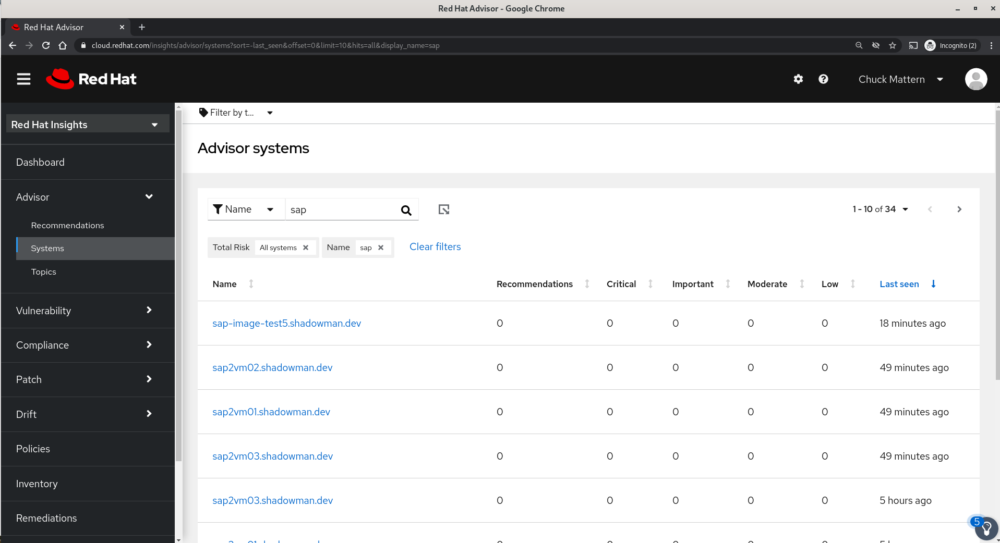
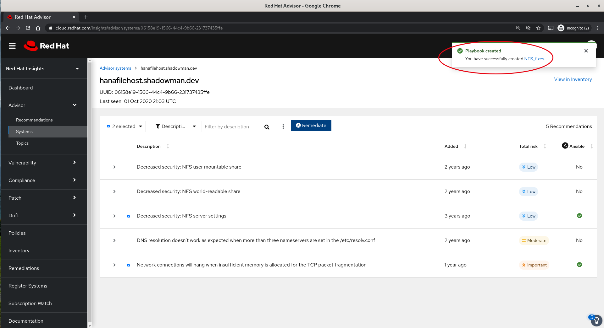
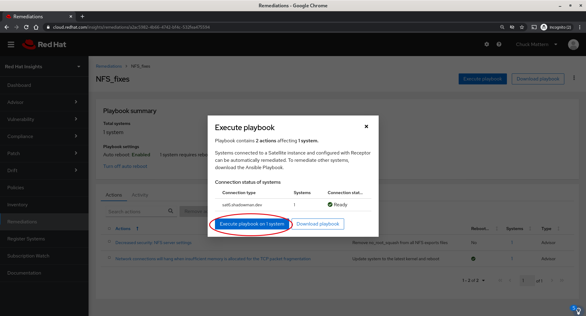
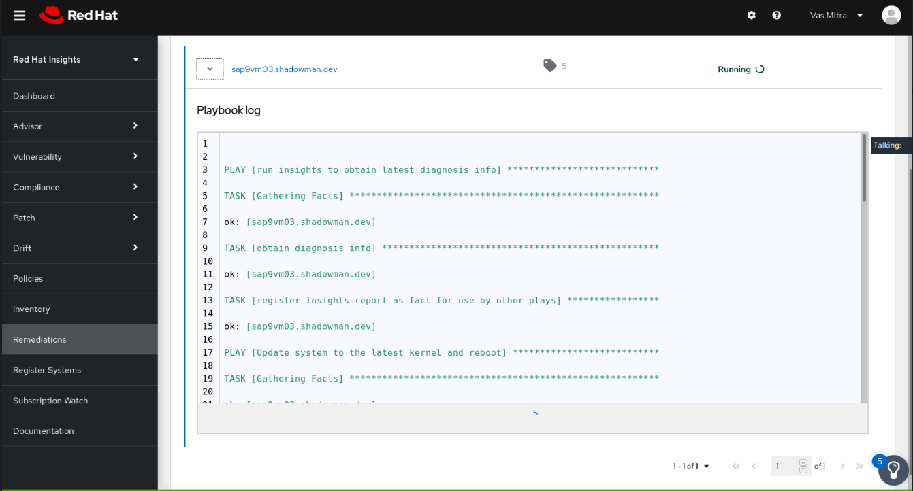

Evaluate SAP Environment with Red Hat Insights
==============================================

Your HANA environment is up and running. What can you do to improve it?

Red Hat Insights is a component of RHEL that will help you detect and address 
- security issues (not just patching) and help to avoid breaches that cost money and erode your brand value 
- compliance issues and help to avoid violations that cost money and erode yur brand value 
- performance and availability issues that cost money and erode internal and external confidence
- consistency issues that reduce efficiency and cost money
do all of the above consistently, mostly automatically, with very little effort which saves money and builds internal and external confidence

Overview
========

In this lab exercise we will walk through the process of evaluating your SAP environment, due to the requirment for live subscriptions this lab will be conducted as a demonstration rahter than an interactive lab. Your servers were automatically registered to Insights duirng the deployment process. 

Logging into cloud.redhat.com
=============================

Open a browser and navigate to https://cloud.redhat.com/ and log in with your credentails

Your initial dashboard will look something like this one

In this view we can see a number of capabilites presented by Insights. The major features we will examine today are:
1. Advisor
1. Vulnerability
1. Compliance
1. Patch
1. Drift

Advisor 
=======

1. Advisor provides reccomendations to improve system performance, reliability and security in a number of formats.

  1. The first is simply known as Reccomendations. This view can be sorted and filtered to help you determine what changes you want to make where they are applicable, the rick and criticality and wheter or not the issues can be automatically remediated.

  1. Advisor also has a Systems view which allows a different view for going stright to a specific system or group of systems, filtering on partial host names allows you to leverage naming convenstions such as all system with hostnames begining in "sap".

  1. In this example we will focus on our file server which we can find by the first few characters of its hostname.

  1. By clicking on the hostname we can evaluate the reccomendations and make a decision on whetehr to take action either immediately or during a future time such as Change Control Window. In this case we can see that we have five reccomendation two of which can be addressed automatically by Ansible

  1. We can select these two items and then click the "Remediate" button

  1. This will take us a to a dialog where we will be prompted to either append to an exsiting Playbook or create a new one. In this case we will create a new Playbook.

  1. Clicking Next takes us to a dialog where we can choose to delay the reboot required for out TCP to a later time but sitll put the fix in place to away the reboot. In this case we will simply move a head with the reboot and proceed to create the playbook.

  1. We will recieve confirmation fo the creation of the playbook and by clicking on the playbook name can go straight on a dialog which allow us to download the playbook for local use or to execute it directly from the Insights interface.

  1. In the next panel we have the dialog which will allow us to execute the playbook as well as a warining that there will be a reboot and the opptortunity to turn off the reboot functionality, again putting the fix in place but delaying the reboot for a future time.

  1. After clicking the "execute playbook button we will see a summary before the final confirmation to execute.

  1. Once the execution commences we will be taken to a status page for the execution in progress.

  1. We can view the status of the playbook execution here (will need to catch interim navigation screen shots.)

  1. Play book reports success

  1. Now the system viewed through Advisor shows no reccomendations

  1. Advisor also provides the ability to view information by Topics such as SAP

    1. Clicking into a Topic provides a view of issues which you may want to address which are specific to that area.
    

